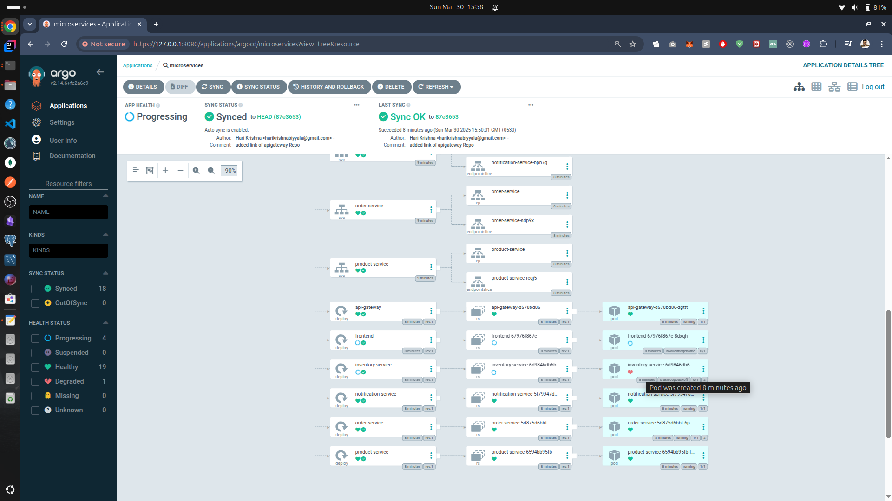

## working in Local minikube

configure minikube with necessary cpu and memory 

```shell
    minikube config set cpus 4
    minikube config set memory 16384
```
start minikube

```shell
   minikube start
```

## Working AWS EKS
- configure aws cli
- create a user who has necessary eks role and policies and create any access key for him
- configure the access key and security key and region 
- install eksctl

creating cluster 

cluster.yml
```yaml

apiVersion: eksctl.io/v1alpha5
kind: ClusterConfig
metadata:
  name: my-eks-cluster
  region: ap-south-2
managedNodeGroups:
  - name: ng-t2-micro
    instanceType: t2.micro
    minSize: 1
    maxSize: 3
    desiredCapacity: 2

```

```shell
  eksctl apply -f cluster.yaml
```

ArgoCD setup 

Reference : https://argo-cd.readthedocs.io/en/stable/getting_started/

Install ArgoCD
```shell
    kubectl create namespace argocd
    kubectl apply -n argocd -f https://raw.githubusercontent.com/argoproj/argo-cd/stable/manifests/install.yaml
```

check argoCD components
```shell
    kubectl get all -n argocd
```

change the type of argocd-server service from ClusterIP to NodePort
```shell
    kubectl edit service/argocd-server -n argocd
```

port forward the argocd-server service

```shell
    kubectl port-forward svc/argocd-server -n argocd 8080:80
```

To login

username : admin
password : 

get from the secret
```shell
    kubectl -n argocd get secret argocd-initial-admin-secret -o jsonpath="{.data.password}" | base64 -d
```
## To create argoCD applications 

First create Application for infrastructure 
```shell
  cd k8s/manifests
  kubectl apply -f infrastructure-argo-app.yml
```
Then create Application for microservices
```shell
    kubectl apply -f applications-argo-app.yml
```

## Clean UP 

Delete the applications from argoCD

then delete the argoCD namespace
```shell
  kubectl delete all --all -n argocd
```



