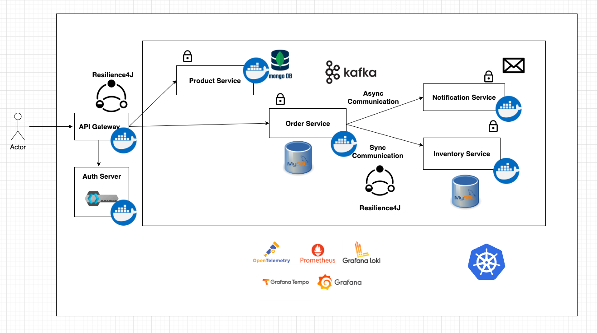
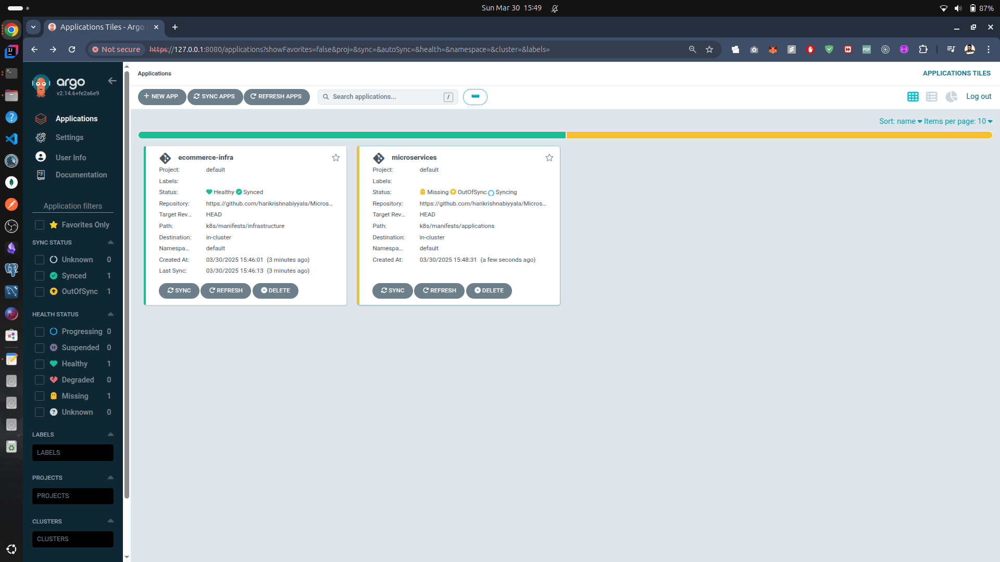
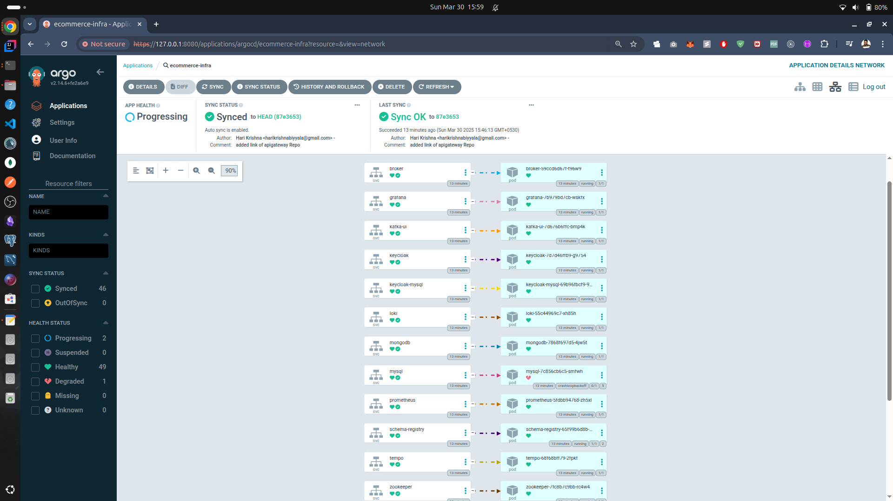
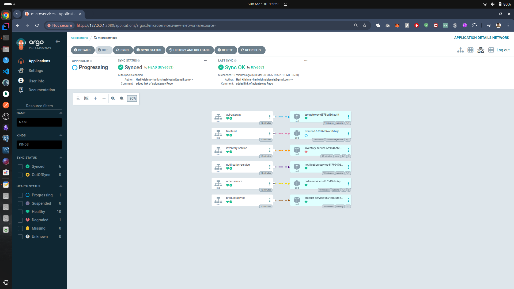
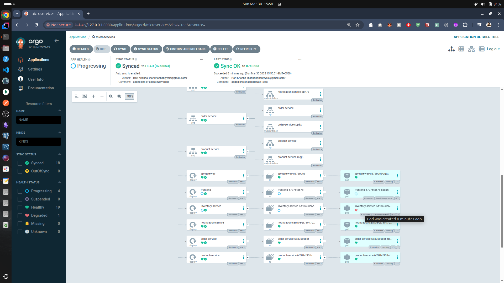

# Project Overview

This README provides a comprehensive guide for a microservices architecture utilizing **Spring Boot** for the backend and **Keycloak** for authentication and authorization. The architecture is designed with scalability and reliability in mind, incorporating various services, messaging systems, and observability tools.

## Frontend
### React Frontend
- **React**: A popular JavaScript library for building user interfaces. The React application serves as the client-side interface for interacting with the backend services.
### Authentication and Authorization
- **Keycloak**: An open-source Identity and Access Management solution that provides features such as Single Sign-On (SSO), user federation, multi-factor authentication (MFA), and fine-grained authorization. It integrates seamlessly with Spring Boot using the Keycloak Spring Security adapter to secure applications efficiently.

## Backend

### Framework
- **Spring Boot**: A powerful framework for building microservices that simplifies the development process by providing built-in features and configurations.

### Microservices Architecture
The backend consists of several microservices, each responsible for specific functionalities:

- **Product Service**: Manages product-related operations. [Product Service Repo](https://github.com/harikrishnabiyyala/product-service)
- **Order Service**: Handles order processing and management. [Order Service Repo](https://github.com/harikrishnabiyyala/order-service)
- **Inventory Service**: Manages inventory levels and stock. [Inventory Service Repo](https://github.com/harikrishnabiyyala/inventory-service)
- **Notification Service**: Sends notifications related to orders and other events. [Notification Service Repo](https://github.com/harikrishnabiyyala/notification-service)

### API Gateway
- **API Gateway**: Acts as a single entry point for all client requests, routing them to the appropriate microservice while enforcing security through Keycloak. [Api Gateway Repo](https://github.com/harikrishnabiyyala/api-gateway)

### Resilience Patterns
- **Circuit Breaker Pattern**: Implemented to prevent cascading failures in microservices.
- **Retry Mechanism**: Automatically retries failed requests to enhance reliability.

### Messaging
- **Kafka**: Utilized for asynchronous communication between services.
- **Avro Data Format & Schema Registry**: Ensures that data serialization is efficient and schema evolution is managed effectively.

### Database Management
- **MySQL & MongoDB**: Used for structured and unstructured data storage respectively.
- **Flyway**: Manages database migrations to ensure schema consistency across environments.

## Testing
- **TestContainers**: Used for integration testing, allowing tests to run in isolated environments with dependencies like databases.

## API Documentation
- **Swagger**: Automatically generates API documentation, which is aggregated at the API Gateway for easy access.

## Mailing
- **MailTrap**: A service used to capture emails sent from the application, specifically for notifying users about new orders.

## Observability
To monitor application performance and troubleshoot issues, the following tools are integrated:
- **Grafana**: For visualizing metrics.
- **Loki**: For log aggregation.
- **Tempo**: For distributed tracing.
- **Prometheus**: For monitoring metrics with dashboards configured via `dashboard.json`, supporting trace ID and span ID tracking.

## Containerization
- **Dockerfile with Multistage Builds**: Optimizes image size by separating build dependencies from runtime dependencies.

### Docker Compose
Utilized to define and run multi-container Docker applications, including:
- Databases (MySQL, MongoDB)
- Keycloak
- Grafana
- Loki
- Tempo
- Prometheus
- Kafka
- Schema Registry

## Continuous Integration (CI)
- **GitHub Workflow**: Automates the process of creating Docker images and pushing them to Docker Hub upon code changes.

## Kubernetes Deployment
The application is configured for Kubernetes with:
- Deployments for managing application instances.
- Services for exposing applications.
- ConfigMaps for configuration management.
- Secrets for sensitive information storage.
- Persistent Volumes (PV) and Persistent Volume Claims (PVC) for data storage.

This architecture ensures a robust, scalable, and maintainable microservices application capable of handling various business processes efficiently.

## Continuous Deployment (CD)
The application infra and microservices are configured with ArgoCD which makes sure the k8's manifest files are in sync with the Actual cluster by periodically
syncing.

Check [ClusterSetUp.md](ClusterSetUp.md) for more images and setup procedure

